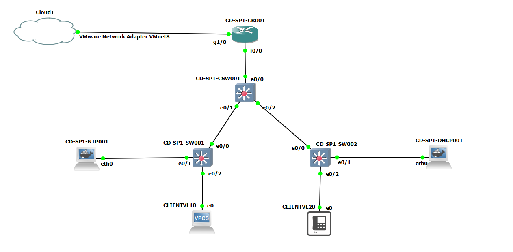

# Laboratório final — topologia, endereçamento e serviços

Documentação de referência do ambiente GNS3 usado para gerar as evidências do
desafio. Todas as configs em [`configs/`](configs/) são as **reais**,
extraídas do laboratório em 22/09/2026 — não são exemplos genéricos.



## Papel de cada equipamento

| Equipamento | Tipo | Papel |
|---|---|---|
| `CD-SP1-CR001` | Roteador (c2900/dynamips) | Roteamento inter-VLAN (subinterfaces 802.1Q) + NAT para a internet via VMnet8 |
| `CD-SP1-CSW001` | Switch (IOU L2) | Core: recebe o trunk do roteador e distribui para os dois switches de acesso |
| `CD-SP1-SW001` | Switch (IOU L2) | Acesso: porta do servidor NTP (VLAN 50) + cliente VLAN_DADOS |
| `CD-SP1-SW002` | Switch (IOU L2) | Acesso: porta do servidor DHCP (VLAN 50) + cliente VLAN_VOZ |
| `CD-SP1-NTP001` | Container Linux (chrony) | Referência de horário para toda a rede |
| `CD-SP1-DHCP001` | Container Linux (dnsmasq) | Atribui IP às VLANs 10 e 20 via DHCP relay |
| `CLIENTVL10` | VPCS | Cliente de teste da VLAN_DADOS |
| `CLIENTVL20` | VPCS | Cliente de teste da VLAN_VOZ |
| `Cloud1` | Nó de rede do GNS3 | Ponte para a VMnet8 (NAT) do host, dando saída de internet à rede |

## Endereçamento

| Rede | CIDR | Gateway | Observação |
|---|---|---|---|
| VLAN 10 — VLAN_DADOS | 192.168.10.0/24 | 192.168.10.1 (CR001) | Pool DHCP: `.100`–`.200` |
| VLAN 20 — VLAN_VOZ | 192.168.20.0/24 | 192.168.20.1 (CR001) | Pool DHCP: `.100`–`.200` |
| VLAN 50 — VLAN_SEGURANÇA (gerência) | 192.168.50.0/24 | 192.168.50.1 (CR001) | Sem DHCP — todos os IPs são fixos |
| VMnet8 (saída internet) | 192.168.113.0/24 | 192.168.113.2 (NAT do VMware) | `CR001` usa `192.168.113.10` |

### IPs fixos na VLAN 50 (gerência)

| Host | IP |
|---|---|
| CR001 (gateway) | 192.168.50.1 |
| CSW001 | 192.168.50.6 |
| SW001 | 192.168.50.7 |
| SW002 | 192.168.50.8 |
| DHCP001 | 192.168.50.10 |
| NTP001 | 192.168.50.20 |

## Cadeia de serviços — por que o `ip helper-address` importa

O DHCP e o NTP não ficam na mesma VLAN de quem os usa — DHCP001 e NTP001
estão na VLAN 50 (gerência), mas atendem clientes nas VLANs 10 e 20. Isso só
funciona por causa de duas configurações no CR001:

- **`ip helper-address 192.168.50.10`** nas subinterfaces `Fa0/0.10` e
  `Fa0/0.20`: converte o broadcast DHCP do cliente em um unicast para o
  servidor, que está em outra VLAN. Sem essa linha, o broadcast nunca sairia
  da VLAN de origem.
- **`ntp server 192.168.50.20`** em cada equipamento Cisco: não precisa de
  helper-address porque é o próprio dispositivo (não um broadcast de
  cliente) fazendo uma requisição unicast diretamente ao servidor — já
  roteável normalmente pelo CR001.

A prova de que os dois fluxos funcionam está documentada em
[`configs/DHCP001.cfg`](configs/DHCP001.cfg) (leases concedidos) e
[`configs/NTP001.cfg`](configs/NTP001.cfg) (`chronyc clients` mostrando os
4 equipamentos Cisco sincronizando o relógio).

## Segurança: hashes de senha redigidos

Os arquivos em `configs/` são cópias sanitizadas das `startup-config` reais.
Os campos `enable secret` e `username admin secret` tinham hashes de senha
(tipo 4 e tipo 5) no arquivo original — foram substituídos por
`<REDIGIDO_NAO_PUBLICADO>` antes de entrar neste repositório público. Mesmo
sendo senha de laboratório, hash de senha não deveria ficar exposto em
repositório público: hashes tipo 5 (MD5-crypt) são quebráveis por força
bruta/dicionário sem muito esforço computacional.

Se for reproduzir este laboratório, defina sua própria senha em cada
equipamento (`enable secret <sua_senha>` / `username admin secret
<sua_senha>`) — não reaproveite hash de outro ambiente.

## Como isso se conecta à automação Python

A automação em `src/`/`app.py`/`cli.py` já reconhece a convenção de nome
usada aqui (`CD-SP1-<TIPO><nº>`) sem gerar aviso de "fora do padrão" — foi
desenhada em cima deste ambiente real, não o contrário. Para reaplicar (ou
só validar) a configuração de qualquer um destes equipamentos:

```bash
python cli.py --host 192.168.50.6 --usuario admin --senha <sua_senha> --enable <sua_senha> --hostname CD-SP1-CSW001
python cli.py --host 192.168.50.7 --usuario admin --senha <sua_senha> --enable <sua_senha> --hostname CD-SP1-SW001
python cli.py --host 192.168.50.8 --usuario admin --senha <sua_senha> --enable <sua_senha> --hostname CD-SP1-SW002
python cli.py --dispositivo router --host 192.168.113.10 --usuario admin --senha <sua_senha> --enable <sua_senha> --hostname CD-SP1-CR001
```

Veja o passo a passo completo (teste do seu PC contra este laboratório,
gravação de evidência, rollback) na seção "Testando contra o laboratório
real" do [`README.md`](../README.md) principal.
